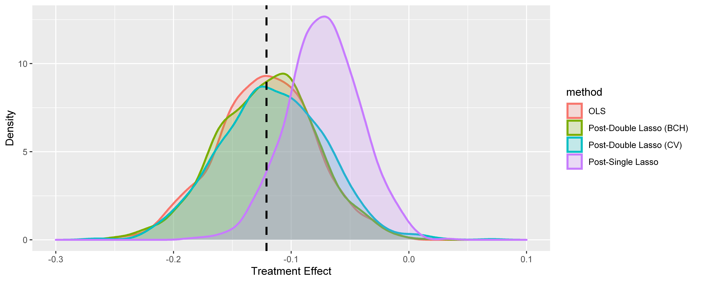

# Performance Comparison between Model Selection Methods | Computational Statistics | Summer Semester 2022

by Minh Tri Hoang | Master of Science in Economics - University of Bonn

This is the final project on Computational Statistics. The course was taught by [Professor Lena Janys](https://sites.google.com/site/janyslena/home?authuser=0) (University of Bonn).

To get started, please clone the repository with

```
git clone https://github.com/mtrihoang/post-double-selection.git
```

This repository contains my statistical simulations for the following paper: Alexandre Belloni, Victor Chernozhukov, and Christian Hansen. 2014. [Inference on Treatment Effects after Selection among High-Dimensional Controls](https://academic.oup.com/restud/article-abstract/81/2/608/1523757?redirectedFrom=fulltext). The Review of Economic Studies. 

In section 1 of the final report, I summarize the intuition of double selection to give more insights into how the method can improve estimation performance compared with standard techniques. Section 2 demonstrates the weakness of the single-selection method in estimating a treatment effect through a simple model. Throughout the section, I conduct simulations for the post-double selection in low-dimensional settings. Section 3 presents a framework of high-dimensional model selections using the Lasso method. Section 4 focuses on an empirical study for performance comparison of post-single and post-double selections in high-dimensional settings. Sections 5 and 6 are conclusions and references, respectively.



